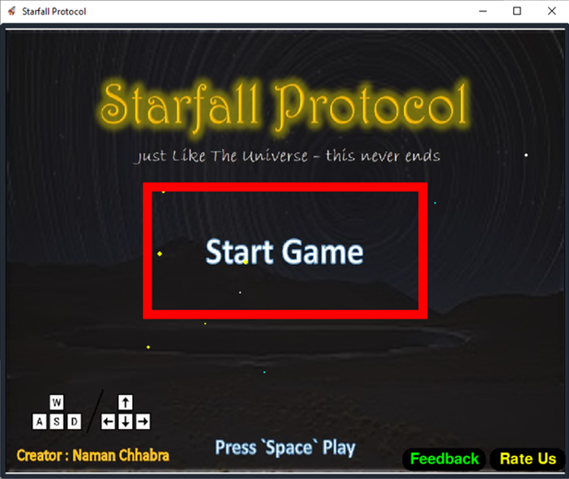

<tr>
<td align="center">

</td>

<td align="center">
</td>
</tr>

# Starfall-Protocol
An UNENDING 2D rocket Game created with Pygame. Featuring custom music, graphics, and keyboard controls. Contains Starting and Ending scene as Videos.

### Controls:
  - `WASD` / Arrow Keys to move
  - `Space` to Start / Pause the Game | Skipping Scenes
  - `m` to mute / unmute sounds

### Features:
##### Dynamic Resizing
- Users can adjust screen size
- Supports Fullscreen
##### Feedback and RateUs button
- Opens CTk screen
- Saves user response in Firebase
##### Scenes
- Plays Starting / Ending videos
- Plays Sound Effects
- Press `Space` to skip scene
### Modules Used:
##### Required Modules
  - requests 
  - customtkinter
  - pygame
  - splashscreen_engine
> Install these using : `pip install requests customtkinter pygame splashscreen-engine`
##### Built-in Modules
  - time
  - os
  - random
  - threading
  - sys
  - platform
  - json
  - datetime
  - uuid

---
## Enabled with ingame Data Processing
- Using Google's Firebase to store User data.
- Using it for realtime data tracking, feedback and rating support.

## Screenshots:
### Loading Screen

### Starting Screen

### Scene-1 The Rocket Starts

### Level Up ( After every 3000 score )

### Collision of Rocket with Obstacles

### Scene-2 The Game Ends

### GAMEOVER

